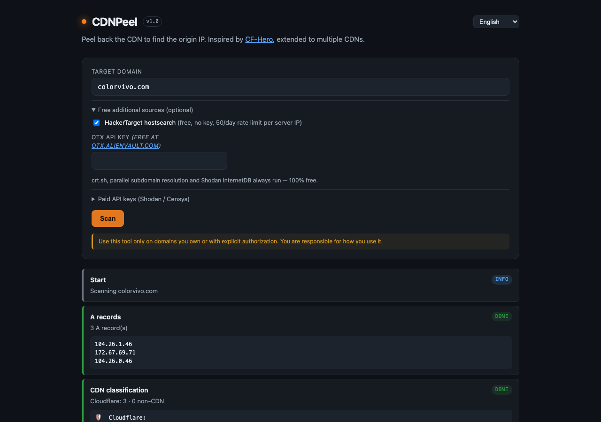
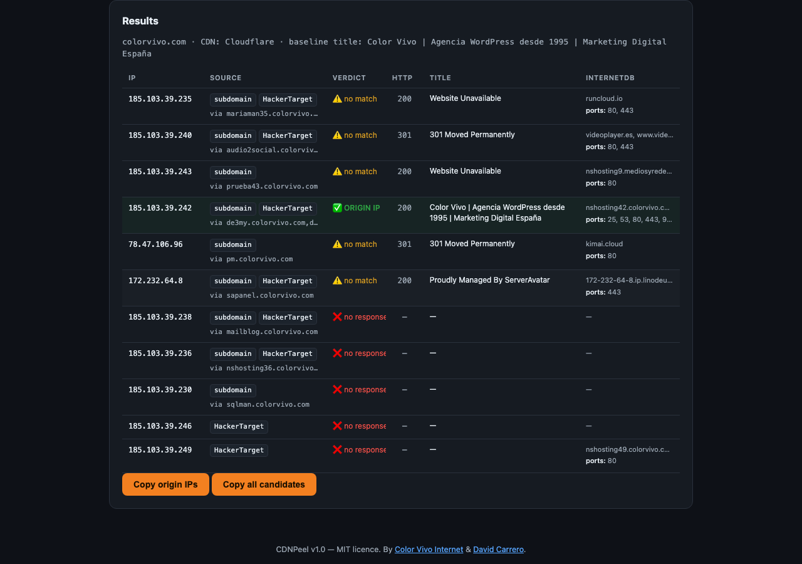

# CDNPeel

> **Peel back the CDN to find the origin IP.**
> A minimalist, dependency-free web tool that discovers the real origin IP address of websites protected by Cloudflare, Fastly, Akamai, AWS CloudFront, Imperva, Sucuri, BunnyCDN, KeyCDN, CDN77, StackPath, Google Cloud Front-end, Azure Front Door and TransparentEdge.

[](#)
[](#license)
[](#)



When the scan finishes, you get a clear table of candidates with the **origin IP** highlighted in green when the title matches the baseline:



## Why this exists

Origin IP discovery used to require [CF-Hero](https://github.com/musana/CF-Hero) — a great Go CLI focused on Cloudflare. CDNPeel takes the same core technique and rebuilds it as a **web tool**, generalised to **any CDN**, with **no installation**, **no dependencies** (PHP + cURL only) and a live progress UI in **8 languages**.

The web format also matters: a sysadmin can audit their own infrastructure from any browser without installing Go or maintaining a CLI. The same workflow works on a phone.

## Quick start

```bash
git clone https://github.com/dcarrero/CDNPeel.git
cd CDNPeel
php -S 127.0.0.1:8080
# open http://127.0.0.1:8080/public/index.html
```

Then type a domain (e.g. `example.com`), optionally tick HackerTarget, and click **Scan**. The pipeline runs live with Server-Sent Events.

## How it works

CDNPeel chains together multiple reconnaissance techniques and validates each candidate IP by **host header bypass**: it opens HTTPS to the candidate IP while sending `Host:` and SNI set to the target domain, then compares the returned `<title>` against the baseline. If they match, the IP is the origin.

```
              ┌────────────────────────────────────────────┐
              │              Target domain                 │
              └──────────────────────┬─────────────────────┘
                                     ▼
   ┌─────────────────┐  ┌──────────────────┐  ┌─────────────────────┐
   │  DNS A records  │  │  DNS TXT / SPF   │  │   crt.sh subdomains │
   │   (DoH 1.1.1.1) │  │  (IP extraction) │  │  (Certificate Trans)│
   └────────┬────────┘  └────────┬─────────┘  └──────────┬──────────┘
            ▼                    ▼                       ▼
        ┌───────────────────────────────────────────────────┐
        │ Classify against 13 CDN providers' IP ranges +    │
        │ rDNS + response headers (Server, X-Cache, CF-RAY) │
        └───────────────┬───────────────────────────────────┘
                        ▼
        ┌───────────────────────────────────────────────────┐
        │ Parallel resolution of all subdomains (curl_multi)│
        │ filter out CDN IPs → non-CDN candidates           │
        └───────────────┬───────────────────────────────────┘
                        ▼
        Optional OSINT enrichment: HackerTarget, OTX, Shodan, Censys
                        ▼
        ┌───────────────────────────────────────────────────┐
        │ Parallel HTTPS probe of each candidate with       │
        │ Host: <target>, compare <title> to baseline       │
        │ + Shodan InternetDB enrichment (free, no key)     │
        └───────────────┬───────────────────────────────────┘
                        ▼
                  Origin IP(s) found
```

### The host header bypass technique

For each candidate IP we run, with cURL:

```php
curl_setopt($ch, CURLOPT_RESOLVE, ["target.com:443:<candidate-ip>"]);
curl_setopt($ch, CURLOPT_URL, "https://target.com/");
```

cURL connects to `<candidate-ip>` but sends `Host: target.com` and `SNI: target.com` automatically. If the candidate is the actual origin server (or any backend that knows the vhost), it returns the same content as the public-facing site — same `<title>`, match.

This is the same approach CF-Hero implements manually in Go; PHP's `CURLOPT_RESOLVE` makes it a 3-liner.

## Supported CDN providers

CDNPeel identifies and filters IPs from the following providers by IP range, reverse DNS and/or response headers:

| Provider | Detection methods |
|---|---|
| Cloudflare | Published CIDRs + `CF-RAY`/`Server: cloudflare` headers |
| Fastly | Published CIDRs + `X-Served-By: cache-…` + `*.fastly.net` rDNS |
| AWS CloudFront | Published CIDRs + `X-Amz-Cf-Id` + `*.cloudfront.net` rDNS |
| Akamai | Best-known CIDRs + `Server: AkamaiGHost` + `*.akamaitechnologies.com` rDNS |
| Imperva (Incapsula) | Published CIDRs + `X-Iinfo` + `*.incapdns.net` rDNS |
| Sucuri | Published CIDRs + `Server: Sucuri/Cloudproxy` |
| BunnyCDN | Known CIDRs + `Server: BunnyCDN` |
| KeyCDN | Known CIDRs + `Server: keycdn-engine` |
| CDN77 | Known CIDRs + `Server: CDN77` |
| StackPath / MaxCDN | Known CIDRs + `Server: NetDNA-cache` |
| Google Cloud Front-end | Published CIDRs (subset) + `1e100.net` rDNS |
| Azure Front Door | Sample CIDRs + `X-Azure-Ref` header |
| TransparentEdge | Known CIDRs + `*.transparentedge.eu` rDNS |

Embedded IP ranges go stale over time. Sources are documented in `api/lib/cdn-ranges.php`; refresh manually when major providers update their lists.

## Data sources

### Always active (free, no key)

1. **Cloudflare DNS-over-HTTPS** (`1.1.1.1/dns-query`) — for all DNS resolution, avoiding the system resolver.
2. **TXT / SPF parsing** — extracts `ip4:` / `ip6:` from SPF records and loose IPs from other TXT records (often expose mail servers or backend infrastructure).
3. **[crt.sh](https://crt.sh/)** — Certificate Transparency log search. Returns every subdomain that ever had a certificate issued. Known to be flaky (frequent 502s); CDNPeel retries once.
4. **Parallel DoH multi-resolution** — resolves all discovered subdomains concurrently (up to 100, concurrency 12) using `curl_multi`. Non-CDN IPs of subdomains belonging to the same company are strong origin candidates.
5. **[Shodan InternetDB](https://internetdb.shodan.io/)** — a free, key-less Shodan endpoint that returns hostnames, open ports and CVEs for any given IP. Used to enrich each candidate so you see what's running on it.

### Opt-in (free, requires checkbox or free registration)

6. **[HackerTarget](https://hackertarget.com/) hostsearch** — free hostname/IP pairs API. Strict 50/day rate-limit per server IP, so it is off by default.
7. **[AlienVault OTX](https://otx.alienvault.com/) passive DNS** — historical IPs the domain pointed to before the CDN was deployed. Anonymous access was removed in 2024; needs a free API key.

### Optional (paid)

8. **[Shodan](https://shodan.io/) DNS domain API** — comprehensive historical and discovery data.
9. **[Censys](https://censys.io/) Search v2** — internet-wide host search by hostname.

## Architecture

```
cdnpeel/
├── public/                ← document root
│   ├── index.html
│   ├── style.css
│   ├── app.js             ← SSE client, i18n, rendering
│   └── locales/
│       ├── en.json
│       ├── es.json
│       ├── fr.json
│       ├── de.json
│       ├── it.json
│       ├── pt.json
│       ├── ja.json
│       └── ko.json
├── api/
│   ├── scan.php           ← SSE endpoint orchestrator
│   └── lib/
│       ├── dns.php          ← DoH resolution (single + parallel)
│       ├── cdn-ranges.php   ← 13-provider classifier + header detection
│       ├── extractor.php    ← TXT/SPF IP extraction
│       ├── http.php         ← cURL with CURLOPT_RESOLVE, single + multi
│       ├── osint.php        ← Shodan, Censys (paid keys)
│       └── free-osint.php   ← crt.sh, HackerTarget, OTX, InternetDB
└── README.md
```

No Composer. No frameworks. No build step. Just PHP 8+ with the standard `curl` extension and HTML/CSS/vanilla JS.

## Internationalisation

The UI is available in **8 languages**: English, Spanish, French, German, Italian, Portuguese, Japanese and Korean.

Each language is a single JSON file in `public/locales/`. Adding a new language is a matter of copying `en.json`, translating values and adding the option to the `<select>` in `index.html`. The preferred language is detected from `navigator.language` and persisted in `localStorage`.

## Deployment

### Local development

```bash
php -S 127.0.0.1:8080
```

### Production (Apache + PHP-FPM)

Point `DocumentRoot` to `public/` and alias `/api` to `api/`:

```apache
DocumentRoot /var/www/cdnpeel/public
Alias /api /var/www/cdnpeel/api

<Directory /var/www/cdnpeel/api>
  Options -Indexes
  Require all granted
</Directory>
```

### Production (nginx + PHP-FPM)

```nginx
root /var/www/cdnpeel/public;

location /api/ {
  alias /var/www/cdnpeel/api/;
  try_files $uri $uri/ =404;
  location ~ \.php$ {
    include fastcgi_params;
    fastcgi_pass unix:/run/php/php8.2-fpm.sock;
    fastcgi_param SCRIPT_FILENAME $request_filename;
    fastcgi_buffering off;        # required for SSE
    fastcgi_read_timeout 600s;
  }
}
```

Notes:
- **`fastcgi_buffering off`** is required so SSE events reach the browser in real time. CDNPeel also sends `X-Accel-Buffering: no`.
- Outbound HTTPS access from the server is required (DoH, crt.sh, InternetDB, and the validation probes themselves).

### Recommended HTTP security headers (production)

The PHP endpoints (`api/scan.php`, `api/init.php`) already emit
`X-Content-Type-Options`, `X-Frame-Options` and `Referrer-Policy`, and
`public/index.html` ships a Content-Security-Policy via `<meta>`. For
defence-in-depth, set the same headers at the web-server level so they
also cover the static assets.

**nginx:**

```nginx
add_header Content-Security-Policy "default-src 'self'; img-src 'self' data:; connect-src 'self'; script-src 'self'; style-src 'self'; base-uri 'none'; frame-ancestors 'none'; form-action 'self'" always;
add_header X-Content-Type-Options "nosniff" always;
add_header X-Frame-Options "DENY" always;
add_header Referrer-Policy "no-referrer" always;
```

**Apache:**

```apache
Header always set Content-Security-Policy "default-src 'self'; img-src 'self' data:; connect-src 'self'; script-src 'self'; style-src 'self'; base-uri 'none'; frame-ancestors 'none'; form-action 'self'"
Header always set X-Content-Type-Options "nosniff"
Header always set X-Frame-Options "DENY"
Header always set Referrer-Policy "no-referrer"
```

### Rate limiting

`api/scan.php` enforces 30 scans/hour per `REMOTE_ADDR` by default. When
deployed behind a trusted reverse proxy, configure the proxy to rewrite
the client IP (`set_real_ip_from` / `mod_remoteip`) before requests reach
PHP, otherwise every client appears as the proxy and shares a single
bucket. Override the default by editing `RL_DEFAULT_LIMIT` in
`api/lib/ratelimit.php`.

A minimal audit trail (`scan_start` and `rate_limited` events, with IP and
domain — no keys) is written to `error_log` for compliance with OWASP A09.

## CLI Runner

CDNPeel includes a command-line script to perform scans directly from the terminal or automate audits. It imports the project libraries and prints progress status with real-time indicators and a summary table with colored results.

### Usage
```bash
php cli/scan.php -d <domain> [options]
```

### Options
- `-d, --domain <domain>`: Target domain to scan (Required).
- `-s, --shodan <key>`: Shodan API key for DNS and favicon searches.
- `--censys-id <id>`: Censys API ID.
- `--censys-secret <secret>`: Censys API Secret.
- `--otx <key>`: AlienVault OTX API key.
- `-h, --use-hackertarget`: Enable HackerTarget subdomain search.
- `-m, --manual-title <title>`: Specify manual web page baseline title.
- `--help`: Show the help menu.

### Example
```bash
php cli/scan.php -d target.com -h -s YOUR_SHODAN_KEY -m "Welcome to target"
```

## Security and legal

Use **only** on domains you own or with explicit written authorization. CDNPeel is intended for:

- Self-audit of your own websites (is my origin exposed?).
- Authorized penetration testing.
- Defensive security research.

Unauthorized use against third parties may violate local computer crime law. **You are solely responsible for how you use this tool.**

## Limitations

- Origin discovery is best-effort. If the origin is properly firewalled (only the CDN can reach it on TCP 443) and never appeared publicly, no tool will find it.
- crt.sh is famously unstable. CDNPeel retries once and continues if it fails.
- Embedded CDN IP ranges drift over time; refresh from the original sources documented in `api/lib/cdn-ranges.php` when needed.
- Akamai does not publish IP ranges, so detection relies on reverse DNS and response headers as well as a small set of known prefixes.

## Roadmap

- [x] Manual title input (for domains stuck on a CDN challenge interstitial)
- [ ] SecurityTrails and ZoomEye integrations (same pattern as Shodan/Censys)
- [x] Batch mode (list of domains)
- [x] Persistent history (opt-in)
- [x] Favicon hash search
- [x] CLI runner

## Credits

CDNPeel is a port of the ideas in **[CF-Hero](https://github.com/musana/CF-Hero)** by **[@musana](https://twitter.com/musana)**, generalised to multiple CDNs and rebuilt as a web tool.

**Authors**

- **[Color Vivo Internet](https://colorvivo.com/)** — agency since 1995
- **[David Carrero](https://carrero.es)** — co-founder

## License

MIT — see [LICENSE](LICENSE) file.

```
Copyright (c) 2026 Color Vivo Internet, David Carrero Fernández-Baillo

Permission is hereby granted, free of charge, to any person obtaining a copy
of this software and associated documentation files (the "Software"), to deal
in the Software without restriction, including without limitation the rights
to use, copy, modify, merge, publish, distribute, sublicense, and/or sell
copies of the Software, and to permit persons to whom the Software is
furnished to do so, subject to the following conditions:

The above copyright notice and this permission notice shall be included in all
copies or substantial portions of the Software.

THE SOFTWARE IS PROVIDED "AS IS", WITHOUT WARRANTY OF ANY KIND, EXPRESS OR
IMPLIED, INCLUDING BUT NOT LIMITED TO THE WARRANTIES OF MERCHANTABILITY,
FITNESS FOR A PARTICULAR PURPOSE AND NONINFRINGEMENT. IN NO EVENT SHALL THE
AUTHORS OR COPYRIGHT HOLDERS BE LIABLE FOR ANY CLAIM, DAMAGES OR OTHER
LIABILITY, WHETHER IN AN ACTION OF CONTRACT, TORT OR OTHERWISE, ARISING FROM,
OUT OF OR IN CONNECTION WITH THE SOFTWARE OR THE USE OR OTHER DEALINGS IN THE
SOFTWARE.
```
